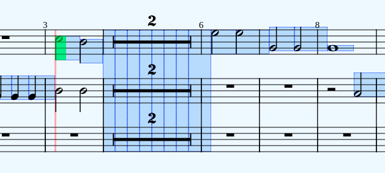
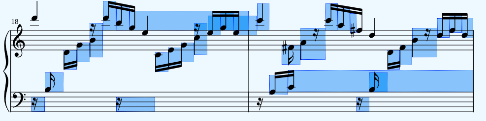

# WebDAW modules

This project is still in a very early stage, eventually it will be a complete set of modules that you can use to build your own web-based DAW. This project is the successor of 2 of my earlier projects: [heartbeat](https://heartbeatjs.org) and [qambi](https://qambi.org), and as such it will contain all functionality of these libraries combined. The current code will be cut into the smallest possible modules for optimal flexibility.

Where heartbeat and qambi need to be imported in their entirety, with the new modular approach you can just import the modules that you need for your project. Also you can change or extend the modules without the risk of breaking anything in the rest of the library because all modules will be able to run without requiring a specific context.

Note however that some modules will need the functionality of other modules, so if for instance module A needs module B and you change something in module B it might break module A. But there are numerous ways to circumvent this from happening, the simplest solution would be to create a new module B1 based on module B. A more elaborate solution is that you make your changes in module B compatible with module A. For every module I will compile a list of the modules that are dependent on that module.

## State management and classes

Notably heartbeat stores a lot of state inside the library code which oftentimes leads to memory leaks or other unwanted behavior. In qambi a part of the state is kept in the members of the instances of some classes, the class MIDIEvent for example.

The new approach will hold no state and use as little classes as possible. This means that state management should be implemented in the code of your project. I often refer to this as 'user code', i.e. the code of the user that uses the module, not sure it that is an appropriate term.

My goal is to create modules that will be basically just functions that transform data structures. Because the data structures are plain objects, they can be very easily stored in any state management setup.

## Roadmap

Here is a quick draft of the order in which I will build the new modules:

- [x] MIDI file parser
- [x] MusicXML file parser
- [x] event scheduler
- [ ] support for loops in event scheduler
- [ ] simple synthesizer
- [ ] soundfont player
- [ ] metronome
- [ ] MIDI recorder
- [ ] audio events
- [ ] utils: quantize, fix note lengths
- [ ] utils: note statistics
- [ ] key editor
- [ ] score view (no editor)
- [ ] audio recorder
- [ ] ....
- [ ] support for MPE
- [ ] sysex support (incl. editor)

<!-- ## API (draft so far)

See [index.d.ts](https://github.com/abudaan/webdaw-modules/blob/master/index.d.ts). -->

## Integration of heartbeat

To make it easier to use WebDAW together with heartbeat I have added the heartbeat code to WebDAW. You can now use heartbeat as a WebDAW module. I will gradually move functionality out of heartbeat into separate WebDAW modules. If you want to use heartbeat in your project you can simply do this like so:

```typescript
import { heartbeat, Heartbeat } from "webdaw-modules";

heartbeat.ready().then(() => {
  const song: Heartbeat.Song = heartbeat.createSong();
});
```

So `heartbeat` (all lowercase) is the module and `Heartbeat` (with capital) is the namespace where all heartbeat typings live.

## About the name

I have deliberately chosen a descriptive name instead of a more 'poetic' name such as heartbeat and qambi because the project is basically just a set of building blocks, not a complete product; I think a poetic name is more something that you put on a completely working DAW (that may or may not use the modules in this project).

The name heartbeat was chosen because before the metronome was invented (and wide-spread) musicians derived tempo from their heartbeat. But the name is actually somewhat misleading because in technology a heartbeat usually refers to the state of a service. The name qambi is a Zulu word that means creator, inventor. I like that name very much but I think it is a bit over the top if I would use it for this project which merely is a simple set of modules.

Also I think the term webdaw, or cased like WebDAW, describes a concept, a way of organizing things. It would be great if together with developers of related libraries some kind of standard can eventually be evolved. Then if our libraries adhere to that standard you can seamlessly connect library A to library B as long as they are both WebDAW compliant.

## Examples

- [basic](https://abudaan.github.io/webdaw-modules/examples/basic)
- [musicxml](https://abudaan.github.io/webdaw-modules/examples/musicxml)
- [scoreviewer (with OSMD)](https://abudaan.github.io/webdaw-modules/examples/scoreviewer3)

## Webpack

I couldn't get webpack-dev-server to work and I didn't have the time to investigate it so for development I use the python webserver:

```bash
python3 -m http.server #run webserver in root folder

cd ./examples

npm run watch #starts webpack in watch mode
```

Now you can see the examples at <http://localhost:8000/examples>.

Because I run the webserver in the root folder, the examples run on github.io as well (the examples need to have the right path to the assets folder).

## Scoreviewer version 3

You can find the live version [here](https://abudaan.github.io/webdaw-modules/examples/scoreviewer3)

### Anchors

This version uses so called anchors to determine the position of the playhead. The anchors are calculated based on the bounding boxes of the rendered svg note elements and contain the following information:

```typescript
export type AnchorData = {
  measureNumber: number;
  startTicks: number;
  endTicks: number;
  bbox: BBox;
  bboxMeasure: BBox;
  yPos: number;
  numPixels: number;
  numTicks: number;
  pixelsPerTick: number;
  ghost: boolean;
  nextAnchor: AnchorData | null;
};
```

Most keys are self-describing. A bounding box (bbox) contains the keys `x`, `y`,`width` and `height`. The key `numPixels` is the distance from the x-position of the current anchor to the x-position of the next anchor. Note that this is the actual travel distance of the playhead and that this value is not the same as the width of the anchor. Also note that in some cases this value is the distance between the x-position of the anchor to the nearest bar line, this is the case when:

- the next anchor lies on the next staff
- the next anchor lies before the current anchor, this happens both in repeated parts of the score and user-set loops

This is done because otherwise the playhead would travel into the next bar before jumping to the next staff or measure, see screenshots with the anchor debugger:

No loop


Loop set on the first bar


The anchor debugger shows all anchors in blue and the anchor that is currently used by the playhead is drawn in green. You can turn this on by importing the `setup` method from `debug_anchor.ts`:

```typescript
import { setup as setupDebugAnchor } from "./debug_anchors";
setupDebugAnchor();
```

A word about the `ghost` key: when a score contains a multi-bar rest, we only have a single graphical element in the score to calculate the playhead position. This can be too coarse and therefor ghost anchors are rendered for every beat in multi-bar rest bars:



### Update the position of the playhead

This is done by two actions:

- `setPlayheadFromPointer.ts` -> when the user clicks somewhere in the score the playhead moves to the nearest anchor
- `setPlayheadFromSong.ts` -> the playhead is synchronized to the position of the song in ticks or milliseconds

In `index.ts` you will find the event listener for `setPlayheadFromPointer` and the other action `setPlayheadFromSong` is called on every animation frame by `songWrapper.ts`.

The calculation of the current anchor based on a user event or the song's position is all done in a webdaw module so you only have to process the returned anchor data.

There is an option to make the playhead jump from anchor to anchor instead of smoothly travelling from one the other by setting `smooth` to `false`;

For example code see the code of the 2 action files listed above.

### Retrieving the anchors

You can use the webdaw module `osmd/getPlayheadAnchorData.ts` to retrieve all anchors from the rendered score, in the example this action is called from `scoreWrapper.ts`. Note that you have to retrieve the anchor data again after the score has resized.

In OSMD an upbeat always has its `measureNumber` key set to 0 which is very unhandy because you can't simply convert measure numbers to indexes by deducting 1 from the measure number. Therefor `getPlayheadAnchorData` returns a key `upbeat` which is true if the score starts with an upbeat; this is key is necessary for multiple calculations, for instance for calculating the right position of a loop.

### Quick run-through of the files

In the actions folder:

- `setPlayheadFromPointer` &rarr; See above.
- `setPlayheadFromSong` &rarr; See above.
- `stopSong` &rarr; Handles everything that is necessary if the song stops, such as updating the position of the playhead.
- `updateBoundingBoxesMeasures` &rarr; Calculates and retrieves the bounding boxes of all measures, this action is currently not used.

Other files:

- `compareScoreAndMidi` &rarr; Can be used to compare the notes in the MIDI file to the notes in the score. Sometimes the order of tracks in the MIDI file is different than the order in the score, by comparing the notes in a certain MIDI track to the notes in a certain staff in the score you can find out how the tracks are mapped to the staves. Note that in most cases the order is correct. Also note that an empty staff in a score will render but an empty track in the MIDI file will be removed.

- `controls` &rarr; Renders the start and stop button at the top of the page.

- `debug_anchors` &rarr; Draws all anchors as transparent blue divs on top of the score. If a score has repeats, the anchors in the areas that repeat will be drawn twice, you can recognize these anchors by their darker color. When the song plays the anchor that is currently used by the playhead to determine its speed and travel distance is rendered in transparent green divs. The width of the green divs is the exact with of the bounding box of the graphical symbol, the width of the blue divs is the travel distance between the subsequent anchors, you can see that the blue ones are rendered consecutively.

- `debug` &rarr; Not in use

- `drawLoop` &rarr; Draws the loop of all bars that were selected by the user before the pointer up event.

- `drawSelection` &rarr; Draws a selection rectangle on top of the score to select a loop, see `drawLoop`

- `files` &rarr; A list of all files that I have tested. I will add a dropdown menu for easy switching between these files and eventually the files that the user can upload themselves.

- `followScore` &rarr; While the song plays this function scrolls the staff where the playhead is currently in to a visible area of the viewport. However, in some cases this can be an annoying feature. This method uses the `yPos` key of the current anchor to determine the scroll position. `yPos` is the y-position of the top-most staff line.

- `index` &rarr; The main file, start your code exploration here.

- `playhead` &rarr; Draws the playhead, subscribes to the store to get notified when the playhead needs to move to another position.

- `scoreWrapper` &rarr; Sets up the score based on the selected MusicXML file.

- `songWrapper` &rarr; Sets up the song based on the selected MIDI file. Starts a requestAnimation loop as soon as the song starts playing that calls the action `setPlayheadFromSong`, see above.

- `sparklingNotes` &rarr; Sets up and performs the highlighting of graphical notes when the song plays. This only works in regular scores that have noteheads. Note: this doesn't work yet with scores with multi-bar rests.

- `store` &rarr; Keeps the state of the application. I use the [zustand](https://github.com/pmndrs/zustand) state manager.

- `utils` &rarr; Utility functions

### Bugs

In some scores the anchor are not calculated correctly which results in the playhead jumping back and forth inside a measure. I am not yet sure whether this problem originates in the code that calculates the anchors or that is because of errors in the MusicXML file. Rest assured that this bug is rather rare. You can easily spot wrong anchor data if you turn on the anchor debugger:



As you can see there are 2 anchor that are way too long. If this error occurs in your score and you can't solve it in the score (for instance by importing and exporting the score in MuseScore) then you can turn off `smooth` which makes the playhead jump from anchor to anchor. Less elegant but at least the playhead isn't jumping all over the place.
