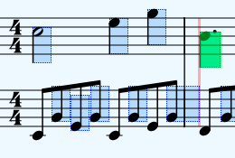
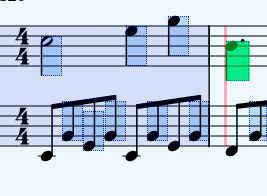

# WebDAW modules

This project is still in a very early stage, eventually it will be a complete set of modules that you can use to build your own web-based DAW. This project is the successor of 2 of my earlier projects: [heartbeat](https://heartbeatjs.org) and [qambi](https://qambi.org), and as such it will contain all functionality of these libraries combined. The current code will be cut into the smallest possible modules for optimal flexibility.

Where heartbeat and qambi need to be imported in their entirety, with the new modular approach you can just import the modules that you need for your project. Also you can change or extend the modules without the risk of breaking anything in the rest of the library because all modules will be able to run without requiring a specific context.

Note however that some modules will need the functionality of other modules, so if for instance module A needs module B and you change something in module B it might break module A. But there are numerous ways to circumvent this from happening, the simplest solution would be to create a new module B1 based on module B. A more elaborate solution is that you make your changes in module B compatible with module A. For every module I will compile a list of the modules that are dependent on that module.

## State management and classes

Notably heartbeat stores a lot of state inside the library code which oftentimes leads to memory leaks or other unwanted behavior. In qambi a part of the state is kept in the members of the instances of some classes, the class MIDIEvent for example.

The new approach will hold no state and use as little classes as possible. This means that state management should be implemented in the code of your project. I often refer to this as 'user code', i.e. the code of the user that uses the module, not sure it that is an appropriate term.

My goal is to create modules that will be basically just functions that transform data structures. Because the data structures are plain objects, they can be very easily stored in any state management setup.

## Roadmap

Here is a quick draft of the order in which I will build the new modules:

- [x] MIDI file parser
- [x] MusicXML file parser
- [x] event scheduler
- [ ] support for loops in event scheduler
- [ ] simple synthesizer
- [ ] soundfont player
- [ ] metronome
- [ ] MIDI recorder
- [ ] audio events
- [ ] utils: quantize, fix note lengths
- [ ] utils: note statistics
- [ ] key editor
- [ ] score view (no editor)
- [ ] audio recorder
- [ ] ....
- [ ] support for MPE
- [ ] sysex support (incl. editor)

<!-- ## API (draft so far)

See [index.d.ts](https://github.com/abudaan/webdaw-modules/blob/master/index.d.ts). -->

## Integration of heartbeat

To make it easier to use WebDAW together with heartbeat I have added the heartbeat code to WebDAW. You can now use heartbeat as a WebDAW module. I will gradually move functionality out of heartbeat into separate WebDAW modules. If you want to use heartbeat in your project you can simply do this like so:

```typescript
import { heartbeat, Heartbeat } from "webdaw-modules";

heartbeat.ready().then(() => {
  const song: Heartbeat.Song = heartbeat.createSong();
});
```

So `heartbeat` (all lowercase) is the module and `Heartbeat` (with capital) is the namespace where all heartbeat typings live.

## About the name

I have deliberately chosen a descriptive name instead of a more 'poetic' name such as heartbeat and qambi because the project is basically just a set of building blocks, not a complete product; I think a poetic name is more something that you put on a completely working DAW (that may or may not use the modules in this project).

The name heartbeat was chosen because before the metronome was invented (and wide-spread) musicians derived tempo from their heartbeat. But the name is actually somewhat misleading because in technology a heartbeat usually refers to the state of a service. The name qambi is a Zulu word that means creator, inventor. I like that name very much but I think it is a bit over the top if I would use it for this project which merely is a simple set of modules.

Also I think the term webdaw, or cased like WebDAW, describes a concept, a way of organizing things. It would be great if together with developers of related libraries some kind of standard can eventually be evolved. Then if our libraries adhere to that standard you can seamlessly connect library A to library B as long as they are both WebDAW compliant.

## Examples

- [basic](https://abudaan.github.io/webdaw-modules/examples/basic)
- [musicxml](https://abudaan.github.io/webdaw-modules/examples/musicxml)
- [scoreviewer (with OSMD)](https://abudaan.github.io/webdaw-modules/examples/scoreviewer3)

## Webpack

I couldn't get webpack-dev-server to work and I didn't have the time to investigate it so for development I use the python webserver:

```bash
python3 -m http.server #run webserver in root folder

cd ./examples

npm run watch #starts webpack in watch mode
```

Now you can see the examples at <http://localhost:8000/examples>.

Because I run the webserver in the root folder, the examples run on github.io as well (the examples need to have the right path to the assets folder).

## Scoreviewer version 3

### Anchors

This version uses so called anchors to determine the position of the playhead. The anchors are calculated based on the bounding boxes of the rendered svg note elements and contain the following information:

```typescript
export type AnchorData = {
  measureNumber: number;
  startTicks: number;
  endTicks: number;
  bbox: BBox;
  bboxMeasure: BBox;
  yPos: number;
  numPixels: number;
  numTicks: number;
  pixelsPerTick: number;
  ghost: boolean;
  nextAnchor: AnchorData | null;
};
```

Most keys are self-describing. A bounding box (bbox) contains the keys `x`, `y`,`width` and `height`. The key `numPixels` is the distance from the x-position of the current anchor to the x-position of the next anchor. Note that this is the actual travel distance of the playhead and that this value is not the same as the width of the anchor. Also note that in some cases this value is the distance between the x-position of the anchor to the nearest bar line, this is the case when:

- the next anchor lies on the next staff
- the next anchor lies before the current anchor, this happens both in repeated parts of the score and user-set loops

This is done because otherwise the playhead would travel into the next bar before jumping to the next staff or measure, see screenshots with the anchor debugger:

No loop



Loop set on the first bar



The anchor debugger shows all anchor in blue and the anchor that is currently used by the playhead is drawn in green. You can turn this on by importing the `setup` method from `debug_anchor.ts`:

```typescript
import { setup as setupDebugAnchor } from "./debug_anchors";
setupDebugAnchor();
```

### Update the position of the playhead

This is done by two actions:

- `setPlayheadFromPointer.ts` -> when the user clicks somewhere in the score the playhead moves to the nearest anchor
- `setPlayheadFromSong.ts` -> the playhead is synchronized to the position of the song in ticks or milliseconds

In `index.ts` you will find the eventlistener for `setPlayheadFromPointer` and the other action `setPlayheadFromSong` is called on every animation frame by `songWrapper.ts`.

The calculation of the current anchor based on a user event or the song's position is all done in a webdaw module so you only have to process the returned anchor data. For example code see the code of the 2 action files listed above.
